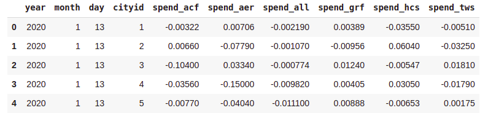

In this hands-on project we aim to predict Seasonally adjusted credit/debit card spending in transportation and warehousing for different users using data from their other forms of spending. The data used is available in the <code>data</code> directory and as mentioned before it consists of information about how users have spent their money on different categories of goods seasonally. You can view the data bellow.

In order to predict the afformentioned value I have used linear regression with <code>PolynomialFeatures</code> resluting in a polynomial regressoin. I have tuned the polynomial degree and observed the best degree.